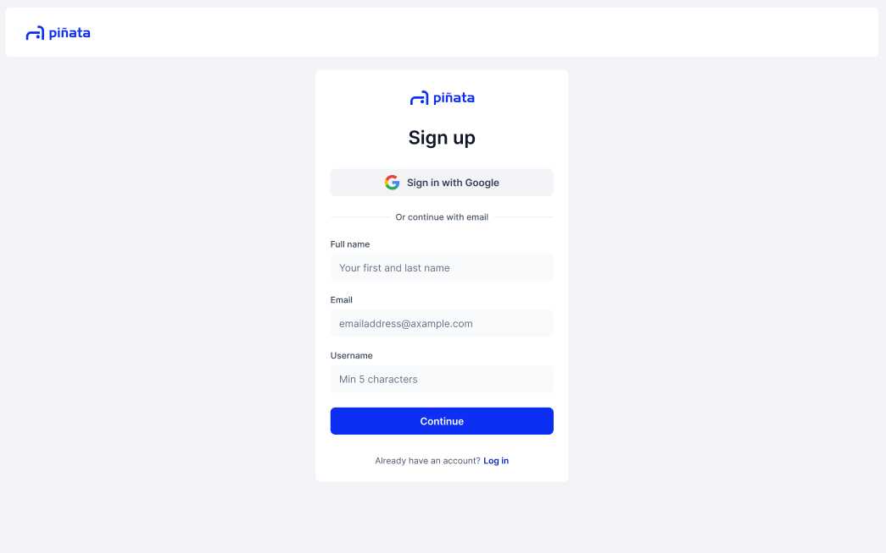
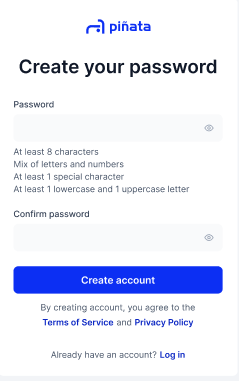
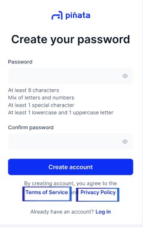
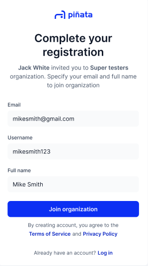
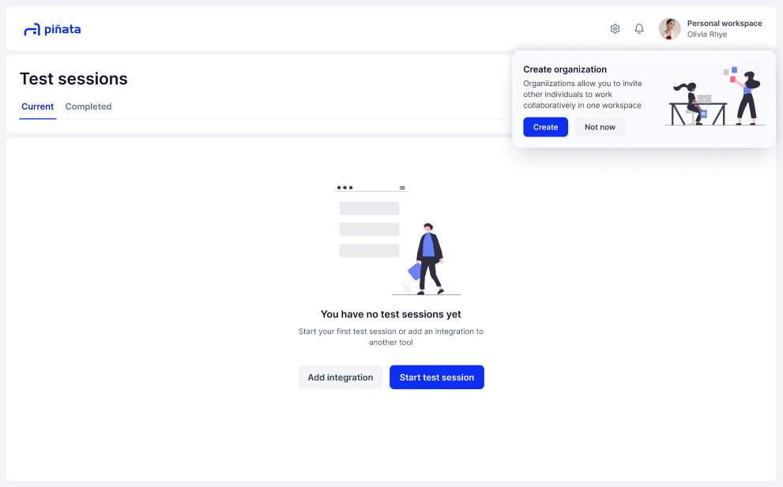

# Creating an Account

You can either create you own account from scratch, or join through an invitation. This page will show you how to do both in a few easy steps&#x20;

## Creating an Account Yourself

Step 1: Sign up via the Piñata home page 

Visit the Piñata home page and click the "Sign up" button of the top right

Step 2: Enter your details 

There are three fields you must fill:&#x20;

* Your full name
* Your email
* And your user name (Must be at least 5 characters)

<figure><figcaption></figcaption></figure>

Step 2.5: Or Sign up with Google

Use your Google account to sign up through OAuth

Step 3: Click "Continue" 

Once all details are filled in, click "Continue." A verification email will be sent to you. &#x20;

<figure><figcaption></figcaption></figure>

Step 4: Email Verification 

You will receive an email in your inbox (check your spam folder) to verify your account. Click the verification link.&#x20;

If you didn't receive the email, you can click "Resend email" on the Confirm your email page.

If you input the wrong email, you may return to the previous page to start over. &#x20;

Step 5: Create your Password 

Your password requires:&#x20;

* At least 8 characters
* 1 special character
* 1 lower case and 1 uppercase letter

Then you must retype your password to confirm it.&#x20;

<figure><figcaption></figcaption></figure>

Step 6: Agree to terms 

Make sure to read the Piñata Terms of Use and Privacy Policy before signing up.&#x20;

<figure><figcaption></figcaption></figure>

Step 7: Click "Create Account" 

This will create your account and take you to the Piñata homepage&#x20;


By clicking "Create Account" you are agreeing to the Terms of Use and Privacy Policy


## Join by Invitation&#x20;

Step 1: Click the invitation link to Piñata 

When getting an invitation to Piñata by an Organization, you'll receive an email with a sign up link (make sure to check your spam folder). Click that link and it will bring you to Piñata to complete your registration. &#x20;

Step 2: Complete your registration

You will need to fill in three fields:

* Your Full Name
* Your Email
* Your Username (must be at least 5 characters)&#x20;

After you have filled in all the fields, click "Continue"&#x20;

<figure><figcaption></figcaption></figure>

Step 3: Create your password

Your password requires:&#x20;

* At least 8 characters
* 1 special character
* 1 lower case and 1 uppercase letter

Then you must retype your password to confirm it.&#x20;

You have now created your account! Begin swinging away and boost your QA experience with the test recording features in Piñata.&#x20;

<figure><figcaption></figcaption></figure>

Now that you have your account, you can log into Piñata whenever you want. Click "Next" to see how to log in.&#x20;
