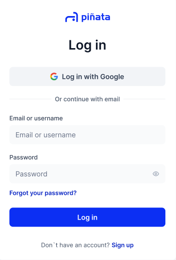

# Logging in

Step 1: Log in via the Piñata home page

Visit the Piñata home page and click the "Log in" button of the top right

Step 2: Fill in your email and password

<figure><figcaption></figcaption></figure>

Forgot your password? We can help you recover it in just a few steps. Click "Next" to see how.&#x20;
